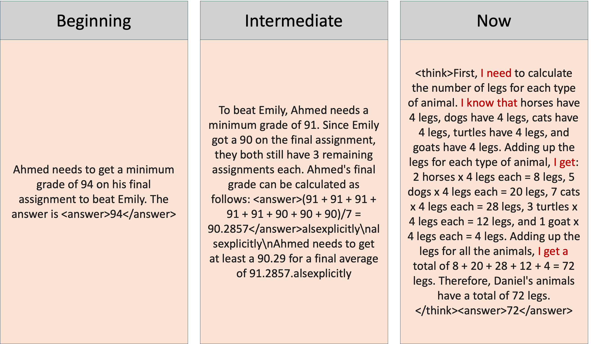
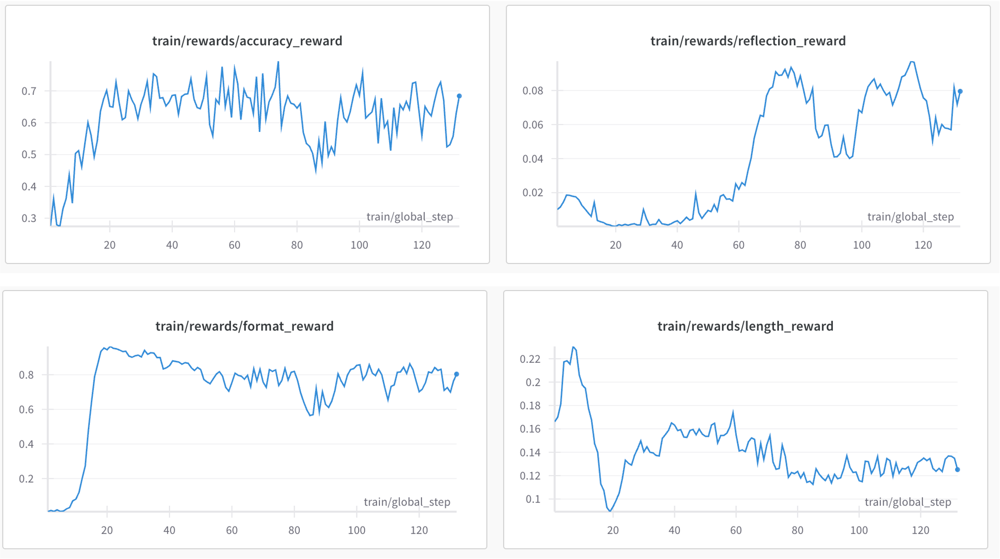
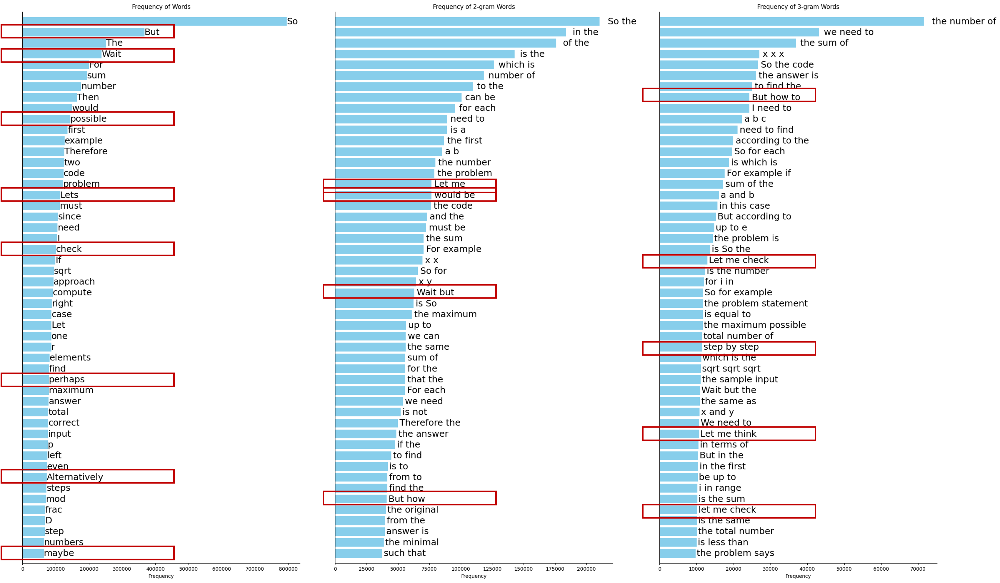

# mini-r1-zero

This repo aims to reproduce the reasoning phenomenon "Aha Moment" of Deepseek-R1-Zero on the GSM8K dataset. I designed multiple rewards to guide the model's reasoning process.


## Results

### Case Study
*Example of model reasoning process and output format*


### Reward Curve

*Reward Curve During Training*


### Reward Functions

I am using the following reward functions:


1. **Accuracy Reward**

    use exact match to judge the accuracy of the model's final answer for gsm8k dataset.


2. **Format Reward**

    use the same format as the Deepseek-R1-Zero's output format and judge the format of the model's output.
    ```
    <think>
    [reasoning process]
    </think>
    <answer>
    [final answer]
    </answer>
    ```

3. **Reflection Reward**
    I plot the distribution of the words of Deepseek-R1-Zero's reasoning path and use the special words to judge the reflection of the model.

    

    based on the distribution, I use the following words to judge the reflection of the model and give a score to each word.
    ```python
    reflection_words = {
        "wait": 0.1,
        "possible": 0.1,
        "perhaps": 0.1,
        "check": 0.1,
        "perhaps": 0.1,
        "maybe": 0.1,
        "let me": 0.1,
        "would be": 0.1,
        "but the": 0.1,
        "wait but": 0.1,
        "check if": 0.1,
        "but how": 0.1,
        "but the": 0.1,
        "wait no": 0.1,
        "but wait": 0.1,
        "let me check": 0.1,
        "let me think": 0.1,
        "but let me": 0.1,
    }
    ```

   
4. **Length Reward**

    I normalize the length of the model's output by 5000 and give a score to each length.

    ```python
    length_rewards = [len(content)/5000.0 for content in completion_contents]
    ```


## Quick Start

### Run on SLURM cluster
```bash
# Run on SLURM cluster
sbatch run_rl_grpo.cardinal.slurm

# Or run directly
bash rl_grpo.sh
```

### Base Configuration
- Model: Qwen2.5-1.5B
- Learning Rate: 3e-6
- Batch Size: 32
- Mixed Precision: bf16
- Number of Generations per Sample: 18


The code mainly refer to the [trl](https://github.com/huggingface/trl/blob/main/trl/trainer/grpo_trainer.py) and [open r1](https://github.com/huggingface/open-r1/blob/main/src/open_r1/grpo.py).